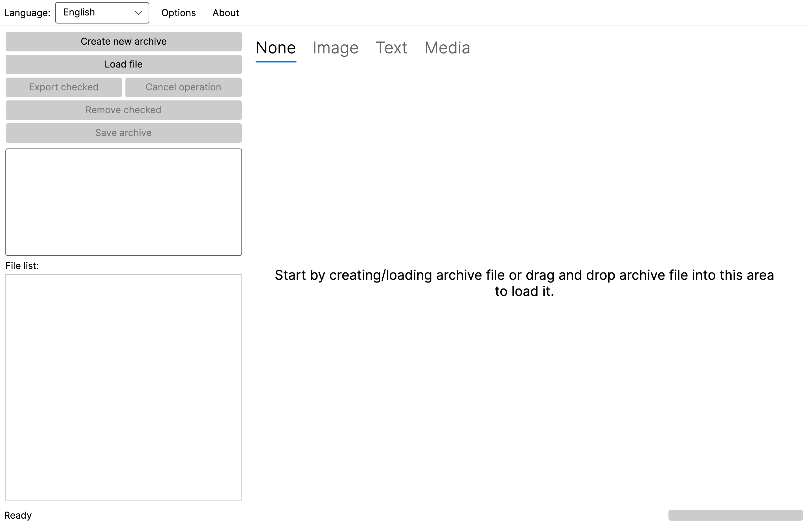

# RPA Explorer

Graphical explorer for RenPy Archives. This tool brings ability to extract, create new or change existing RPA archives all in one window. It also provides content preview for most common files in these packages.

> **This is a cross-platform fork.** The application has been ported from Windows Forms
> (.NET Framework 4.6.1) to [Avalonia UI](https://avaloniaui.net/) on **.NET 8**, so it now runs
> natively on **macOS (Apple Silicon and Intel), Linux and Windows**.
>
> Upstream project: [UniverseDevel/RPA-Explorer](https://github.com/UniverseDevel/RPA-Explorer)
> by Martin Suchy. The archive format handling is his; this fork changes the UI layer and the
> platform-specific plumbing. Initial parser code was inspired by
> [RPATools](https://github.com/Shizmob/rpatool).

---



---

## Running it

Pre-built, self-contained binaries for macOS, Windows and Linux are attached to each
[release](https://github.com/davidwhitney/RPA-Explorer/releases) — no .NET installation required.

| Platform | Download | Notes |
| --- | --- | --- |
| macOS (Apple Silicon) | `…-osx-arm64.zip` | contains `RPA Explorer.app` |
| macOS (Intel) | `…-osx-x64.zip` | contains `RPA Explorer.app` |
| Windows | `…-win-x64.zip` | run `RpaExplorer.exe`; also used on Windows ARM |
| Windows (smaller) | `…-win-x64-novlc.zip` | same, but needs VLC installed - see below |
| Linux | `…-linux-x64.tar.gz` / `…-linux-arm64.tar.gz` | run `RpaExplorer` |

The macOS builds are not code-signed or notarised. On first launch use **right-click → Open**, or
run `xattr -dr com.apple.quarantine "RPA Explorer.app"`.

### Which Windows download?

`win-x64.zip` (87MB) bundles VLC's libraries, so audio and video preview work out of the box with
nothing else to install. `win-x64-novlc.zip` (43MB) is the same application without them, for
people who already have [VLC](https://www.videolan.org/vlc/) installed or would rather install it
separately - the app finds a system-wide VLC on Windows just as it does on macOS and Linux, and
prompts with a download link if there is not one. Everything other than media preview behaves
identically in both.

Each release includes a `SHA256SUMS` file if you want to verify a download:

```bash
shasum -a 256 -c SHA256SUMS --ignore-missing   # macOS
sha256sum -c SHA256SUMS --ignore-missing       # Linux
```

There is no separate Windows ARM download. VideoLAN publishes no Windows arm64 build of VLC, so
an arm64 binary could never play media; Windows on ARM runs the x64 build under emulation with
everything working, so that is the one to use.

## Set-up is automatic

Everything core — browsing, extracting, creating and saving archives, image and text preview —
works with no additional software at all. The two optional previews configure themselves:

**VLC is found for you.** Audio and video preview needs VLC on macOS and Linux. The app locates
an existing installation (`/Applications/VLC.app`, `~/Applications`, or the standard Linux plugin
directories) and wires up its libraries and codec plugins itself. If VLC is missing you get a
prompt with a download link — and the Homebrew one-liner when `brew` is detected — instead of a
dead end. Detection re-runs when you open a media file, so installing VLC while the app is running
just works, with no restart. On Windows the native libraries are bundled outright.

**Python is found for you, pyenv included.** Compiled script preview needs a Python interpreter.
The app searches `PATH`, [pyenv](https://github.com/pyenv/pyenv) (`$PYENV_ROOT`/`~/.pyenv` shims
first, then `versions/*/bin` newest-first) and the usual system locations, preferring Python 3.
The pyenv support matters because an app launched from Finder or the Dock does not inherit your
shell `PATH`, so pyenv would otherwise be invisible even though `python3` works in your terminal.

**unrpyc downloads itself.** Rather than making you find and install it,
**Options → Download unrpyc** fetches a pinned release of
[unrpyc](https://github.com/CensoredUsername/unrpyc) and selects it. You are also offered the
download inline the first time you open a `.rpyc`, and the preview is retried automatically once
it lands. An existing download is reused silently.

Anything auto-detected can be overridden under **Options**, and your choice always wins.

## Supported file types for preview

- Text: py, rpy~, rpy, txt, log, nfo, htm, html, xml, json, yaml, csv
- Video: 3gp, flv, mov, mp4, ogv, swf, mpg, mpeg, avi, mkv, wmv, webm
- Audio: aac, ac3, flac, mp3, wma, wav, ogg, cpc
- Images: jpeg, jpg, bmp, tiff, png, webp, exif, ico, gif
- Compiled scripts: rpyc~, rpymc~, rpyc, rpymc

---

## What changed in the port

| Area | Before | Now |
| --- | --- | --- |
| UI | Windows Forms | Avalonia UI 11 |
| Runtime | .NET Framework 4.6.1 | .NET 8 |
| Compression | `Ionic.Zlib` | built-in `System.IO.Compression.ZLibStream` |
| Images / WebP | `System.Drawing` + native WebP wrapper | [ImageSharp](https://github.com/SixLabors/ImageSharp) |
| Media | `LibVLCSharp.WinForms` | `LibVLCSharp.Avalonia` |
| Python discovery | Windows registry | `PATH`, pyenv and common install locations |
| File associations | registry | Windows only; hidden elsewhere |

A few notes on the trickier parts:

- **Media on macOS/Linux binds to a system VLC install.** The `VideoLAN.LibVLC.Mac` NuGet package
  is deliberately not used: it ships a single x86_64 `libvlc.dylib` with no plugin set, so it
  cannot work on Apple Silicon and has no codecs anywhere. Windows uses
  `VideoLAN.LibVLC.Windows`, which is gated on the *target* runtime identifier so that
  cross-compiled Windows builds still bundle the natives.
- **Python 3 is preferred** when auto-detecting an interpreter, because current unrpyc releases
  require it and Ren'Py 8 games produce Python 3 `.rpyc` files. Python 2.7 is still accepted as a
  fallback for legacy unrpyc with older archives.
- **Archive handling is unchanged in behaviour.** RPA versions 1, 2, 3 and 3.2 are read and
  written as before; the round-trip is byte-exact.

## Building from source

Requires the [.NET SDK 10.0 or newer](https://dotnet.microsoft.com/download).

```bash
dotnet build RpaExplorer.slnx
dotnet run --project src/RpaExplorer/RpaExplorer.csproj

# optionally open an archive directly
dotnet run --project src/RpaExplorer/RpaExplorer.csproj -- /path/to/archive.rpa
```

### Producing release binaries

`build.sh` cross-compiles every supported platform from a single machine into `./dist`
(git-ignored). Builds are self-contained.

```bash
./build.sh                                  # all platforms, version from the current git tag
./build.sh --version 1.2.3                  # explicit version
./build.sh --rids "osx-arm64 win-x64"       # subset of platforms
./build.sh --framework-dependent            # smaller, requires .NET on the target
```

Targets: `osx-arm64`, `osx-x64`, `win-x64`, `linux-x64`, `linux-arm64`, plus a second Windows
package without the bundled VLC natives. macOS
artifacts are packaged as a `RPA Explorer.app` bundle, Windows as a zip and Linux as a tarball,
alongside a `SHA256SUMS` file.

Pushing a `v*` tag runs the same script in GitHub Actions and publishes the artifacts to a GitHub
release — see [`.github/workflows/build.yml`](.github/workflows/build.yml).

---

## TODO

See [TODO.md](TODO.md).

---

This is a fan made application and there is no guarantee of further development or fixes.

The software is provided "as is", without a warranty of any kind, express or implied, including but not limited to the warranties of merchantability, fitness for a particular purpose and non-infringement. In no event shall the authors or copyright holders be liable for any claim, damages or other liability, whether in an action of contract, tort or otherwise, arising from, out of or in connection with the software or the use or other dealings in the software.
